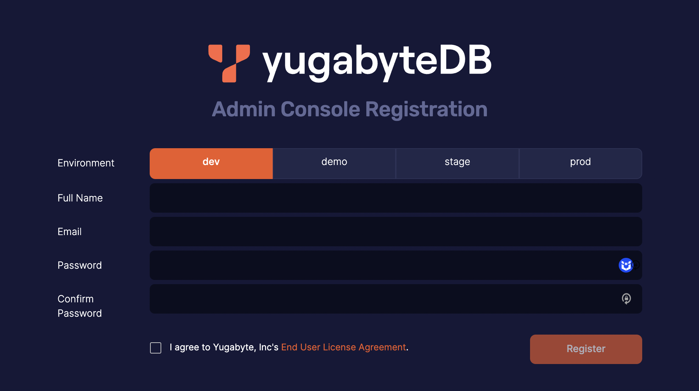

## はじめに
Duration: 05:00

###
YBA Installerとは
YBA Installerは名前通りYBAをインストールするツールです。従来のReplicatedと比べると、Dockerに依存しない、必要なリソースが少ないなどのアドバンテージがあります。

Replicatedと同様に、新規にインストール、既存環境のアップグレード、複数Universeの管理などの機能が持っています。

なお、EAですが、既存のReplicated環境からの移行もサポートされています。

今回は時間制限があるため、新規にインストールと既存環境のアップグレードおよび管理の3点をHands-on Labで実施します。

### Pre-flight Check

YBA Installerを利用する前に、下記のPre-Flight Checkを実施してください。

- [対応OS](https://docs.yugabyte.com/preview/reference/configuration/operating-systems/#yugabytedb-anywhere)
- Python: v3.8 ~ 3.11 
- Vcpuは4 cores以上
- メモリーは8 GB memory以上
- ディスクは215 GB以上
- 下記のポートが開放されている。
    - 443 (HTTPS)
    - 5432 (PostgreSQL)
    - 9090 (Prometheus)
- 本番環境では、一部の YBA Installer コマンドに sudo 権限が必要です。
- sudoパーミッションが制限されている場合は、sudoersファイルのrootの許可リストに以下を追加する：
    - `/bin/mv, /usr/bin/find, /opt/yugabyte/software/*/pgsql/bin/createdb, /opt/yugabyte/software/*/pgsql/bin/initdb`
  
### **ハンズオンで実施すること**

今回のハンズオンにて、下記の内容を実施します。

- YBA環境のインストール
- YBA環境の管理
- YBA環境のアップグレード


## YBA環境のインストール
Duration 45:00

### YBA Installerのダウンロード

下記のコマンドでYBA Installerをダウンロードし、解凍する：

```
wget https://downloads.yugabyte.com/releases/2.19.3.0/yba_installer_full-2.19.3.0-b140-linux-x86_64.tar.gz
tar -xf yba_installer_full-2.19.3.0-b140-linux-x86_64.tar.gz
cd yba_installer_full-2.19.3.0-b140/
```

ダウンロードしたバンドルはYBAの新規インストールに必要なもの（ライセンス以外）全てを提供します。

- `yba-ctl`は、YBAインストーラのすべてのワークフローを実施するBinaryです。
- `yba-ctl.yml.reference`はYBA InstallerとYugabyteDB Anywhereの両方で利用可能な設定オプションのYAML参照ファイルです。

`preflight`と`install`を含め、多くの`yba-ctl`コマンドが設定ファイルが必要です。設定ファイルが指定されていない場合、下記のようにデフォルト設定でインストール継続するかどうかの確認が出ます。

```
$ sudo ./yba-ctl preflight

No config file found at '/opt/yba-ctl/yba-ctl.yml', creating it with default values now.
Do you want to proceed with the default config? [yes/NO]:
```

`yes`を回答する場合、デフォルト設定でインストールを進みますが、`no`を回答する場合、インストールはキャンセルされます。

デフォルトでは、YBA InstallerはYBAを`/opt/yugabyte`にインストールし、YBAプロセスを実行するLinuxユーザー`yugabyte`を作成する。

オプションのリストについては、こちらの[リンク](https://docs.yugabyte.com/preview/yugabyte-platform/install-yugabyte-platform/install-software/installer/#configuration-options)を参照してください。

YBA Installerの設定オプションは下記となります。必要に応じて編集してください。

| OPTION | DESCRIPTION |
| ---- | ---- |
| installRoot | YBAがインストールされている場所。デフォルトは`/opt/yugabyte` |
| host | CORSおよび証明書作成に使用するホスト名またはIPアドレス。Optional |
| server_cert_path,server_key_path | カスタム証明書を提供する場合は、これらの値をパスに指定します。指定しない場合は、インストール処理で自己署名証明書が生成されます。Optional |
| service_username |  YBAプロセスを実行するLinuxユーザー。デフォルトは`yugabyte`。インストール・プロセスで`yugabyte`ユーザーが作成されます。別のユーザーを使用したい場合は、事前にそのユーザーを作成し、`service_username`で指定してください。YBAインストーラは`yugabyte`ユーザのみを作成し、カスタム・ユーザ名は作成しません |

### YBA InstallerでYBAをインストール

下記のように`license`コマンドを実行して、YBAインストーラにライセンスを提供します。

```
sudo ./yba-ctl license add -l /path/to/license
```

実際にインストールする前に、Pre-flight Checkを実行し、期待されるポートが利用可能であること、ハードウェアが最小要件を満たしていることなどを確認することを推奨します。Pre-flight Checkを実施することで、問題を修正するためのレポートが生成されます。

```
$ sudo ./yba-ctl preflight

#  Check name             Status   Error
1  license                Critical stat /opt/yba-ctl/YBA.lic: no such file or directory
2  install does not exist Pass
3  validate-config        Pass
4  user                   Pass
5  cpu                    Pass
6  memory                 Pass
7  port                   Pass
8  python                 Pass
9  disk-availability      Pass
10 postgres               Pass
```

テストや評価のためにYBA Installerを利用し、失敗しているチェックをスキップしたい場合は、`-skip_preflight <name>[,<name2>]`を渡すことができる。例えば:

```
sudo ./yba-ctl preflight --skip_preflight cpu
```

次に、YBAインストールに入ります。

```
$ sudo ./yba-ctl install

               YBA Url |   Install Root |            yba-ctl config |              yba-ctl Logs |
  https://10.150.0.218 |  /opt/yugabyte |  /opt/yba-ctl/yba-ctl.yml |  /opt/yba-ctl/yba-ctl.log |

Services:
  Systemd service |       Version |  Port |                            Log File Locations |  Running Status |
         postgres |         10.23 |  5432 |          /opt/yugabyte/data/logs/postgres.log |         Running |
       prometheus |        2.42.0 |  9090 |  /opt/yugabyte/data/prometheus/prometheus.log |         Running |
      yb-platform |  2.19.3.0-b140 |   443 |       /opt/yugabyte/data/logs/application.log |         Running |
INFO[2023-04-24T23:19:59Z] Successfully installed YugabyteDB Anywhere!
```

インストールが成功したら、すぐにYBAを使い始めることができます。



なお、今回は時間とリソース制限のため、Universeの作成はスキップさせていただきます。

## YBA環境の管理

Duration: 45:00
### YBA設定情報の変更

YBA Installerは、インストール済みのYBAインスタンスの設定情報を変更し、再構築することができます。

インストールを再設定するには、`/opt/yba-ctl/yba-ctl.yml`設定ファイルを変更してから、以下のようにコマンドを実行する：

```
$ sudo yba-ctl reconfigure
```

変更可能な情報リストはこちらの[リンク](https://docs.yugabyte.com/preview/yugabyte-platform/install-yugabyte-platform/install-software/installer/#yba-installer-configuration-options)を参照ください。

### YBAサービス管理

YBA インストーラは、`start`、`stop`、`restart`コマンドによる基本的なサービス管理を提供します。これらのコマンドは全てのサービス(`platform`, `postgres`, `prometheus`)、または個々のサービスに対して実行することができます。

```
$ sudo yba-ctl [start, stop, reconfigure]
$ sudo yba-ctl [start, stop, reconfigure] prometheus
```

他に、`status`コマンドを使用すると、ログや設定の場所、各サービスのバージョン、YugabyteDB Anywhere UI にアクセスするための URL などの情報に加えて、すべての YugabyteDB Anywhere サービスの状態を表示できます。

```
sudo yba-ctl status

               YBA Url |   Install Root |            yba-ctl config |              yba-ctl Logs |
  https://10.150.0.218 |  /opt/yugabyte |  /opt/yba-ctl/yba-ctl.yml |  /opt/yba-ctl/yba-ctl.log |

Services:
  Systemd service |       Version |  Port |                            Log File Locations |  Running Status |
         postgres |         10.23 |  5432 |          /opt/yugabyte/data/logs/postgres.log |         Running |
       prometheus |        2.42.0 |  9090 |  /opt/yugabyte/data/prometheus/prometheus.log |         Running |
      yb-platform |  2.19.3.0-b140 |   443 |       /opt/yugabyte/data/logs/application.log |         Running |
```

### バックアップとリストア

YBA Installerには、YBAの状態（ただしYugabyteDBではない）の完全なバックアップを取り、後でそこからリストアするためのユーティリティも用意されている。これには、YBA UIで見られるUniverseデータだけでなく、Prometheusに保存されているメトリクスも含まれます。

バックアップを実行するには、バックアップを生成するディレクトリへのフル・パスを指定します。`createBackup`コマンドは、バックアップ用のタイムスタンプ付き`tgz`ファイルを作成します。例えば：

```
sudo yba-ctl createBackup ~/test_backup
INFO[2024-02-14T14:59:11Z] Creating a backup of your YugabyteDB Anywhere Installation.


ls test_backup/
backup_24-02-14-14-59.tgz  version_metadata_backup.json
```
バックアップからリストアするには、`restoreBackup`コマンドを使用します：

```
sudo yba-ctl restoreBackup ~/test_backup/backup_23-04-25-16-64.tgz
INFO[2024-02-14T15:04:20Z] Restoring a backup of your YugabyteDB Anywhere Installation.
```

### `yba-ctl`を実行する際の注意点

YBA Installerのコマンドは以下のコンテキストで実行されます：

* `./yba-ctl`はローカル実行パスを利用
* `yba-ctl`はインストールされた実行パスを利用
  
これは、ローカル実行コンテキストを必要とするコマンドもあれば、インストールされたシステムのコンテキストを必要とするコマンドもあるためです。

以下のコマンドは、ローカル実行パスを使用して実行する必要があります：

* installer
* upgrade

以下のコマンドは、インストールされた実行パスを使用して実行する必要があります：

* createBackup
* restoreBackup
* clean
* start, stop, restart, status 
* reconfigure

`help`、`license`、`preflight`コマンドはどちらのコンテキストでも実行できます。

正しい実行パスを使用しない場合、yba-ctlはエラーで失敗します：

```
sudo ./yba-ctl createBackup ~/backup.tgz
FATAL[2024-02-14T15:05:51Z] createBackup must be run from /opt/yba-ctl/yba-ctl. It may be in the systems $PATH for easy of use.
```

## YBA環境のアップグレード

Duration: 20:00

YBA Installerを使用してアップグレードするには、まずアップグレードしたいYBAのバージョンに対応するバージョンのYBA Installerをダウンロードする必要があります。具体的なバージョンはこちらの[リンク](https://docs.yugabyte.com/preview/releases/yba-releases/)を参照してください。

今回は`v2.20.1.3`を利用し、アップグレードのワークフローを説明します。

まずは、インストールと同様に、ファイルをダウンロードし、解凍します。

```
wget https://downloads.yugabyte.com/releases/2.20.1.3/yba_installer_full-2.20.1.3-b3-linux-x86_64.tar.gz
tar -xf yba_installer_full-2.20.1.3-b3-linux-x86_64.tar.gz
cd yba_installer_full-2.20.1.3-b3/
```

https://downloads.yugabyte.com/releases/2.20.1.3/yba_installer_full-2.20.1.3-b3-linux-x86_64.tar.gz

次に、`Preflight`を実行してシステムが正常な状態であることを確認します。

```
sudo ./yba-ctl preflight

xxxx

#  Check name             Status   Error
1  port                   Critical could not listen on port(s) [9090 443 5432] - check they are free
2  install does not exist Pass
3  validate-config        Pass
4  user                   Pass
5  cpu                    Pass
6  memory                 Pass
7  python                 Pass
8  disk-availability      Pass
9  license                Pass
10 db-config              Pass
11 validate-locale-config Pass
12 prometheus             Pass
13 postgres               Pass
FATAL[2024-02-15T00:27:33Z] preflight failed
```

アップグレードの準備ができたら、YBAアップグレードの対象バージョンの
ディレクトリからアップグレードコマンドを実行します：

```
sudo ./yba-ctl upgrade
```

アップグレードが完了するまで数分かかります。アップグレードが完了したら、`status`コマンドを使用して、YBA がターゲット・バージョンにアップグレードされたことを確認します。

```
             YBA Url |   Install Root |            yba-ctl config |              yba-ctl Logs |
  https://10.146.0.2 |  /opt/yugabyte |  /opt/yba-ctl/yba-ctl.yml |  /opt/yba-ctl/yba-ctl.log |

Services:
  Systemd service |      Version |  Port |                            Log File Locations |  Running Status |
         postgres |         14.9 |  5432 |          /opt/yugabyte/data/logs/postgres.log |         Running |
       prometheus |       2.47.1 |  9090 |  /opt/yugabyte/data/prometheus/prometheus.log |         Running |
      yb-platform |  2.20.1.3-b3 |   443 |       /opt/yugabyte/data/logs/application.log |         Running |
```